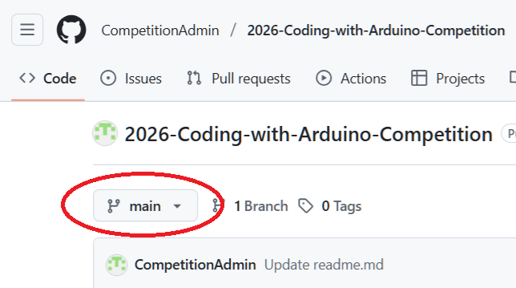
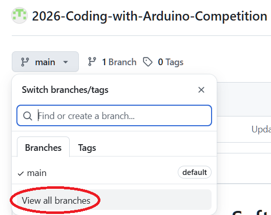
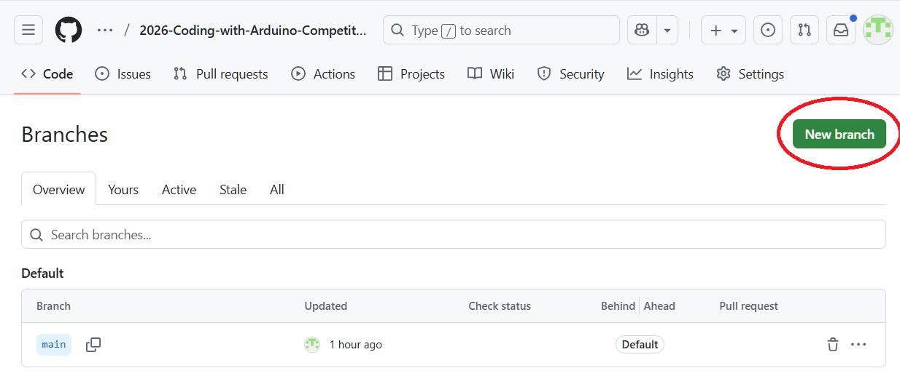
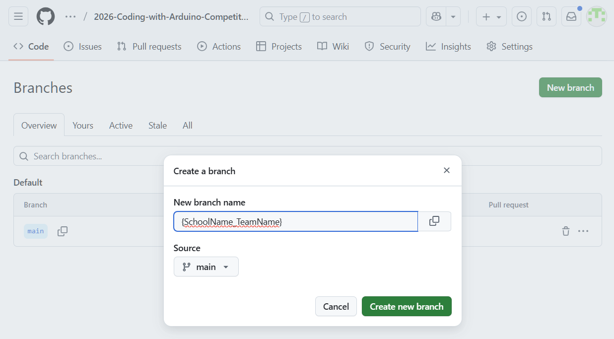
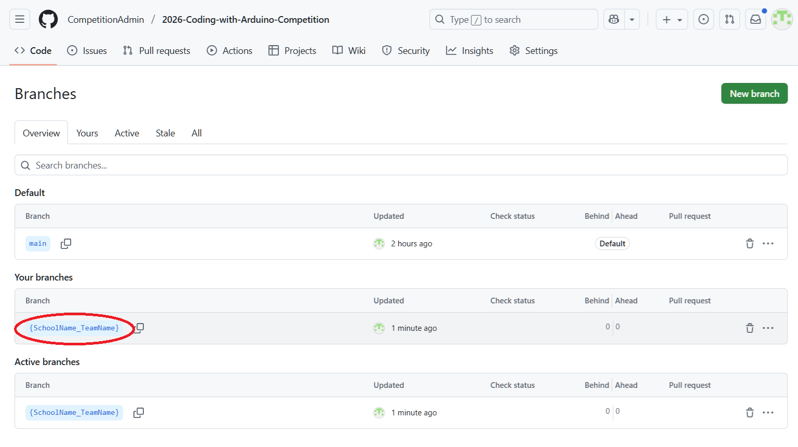

# Coding with Arduino Software Engineering Competition

Use this Git repo to upload your teams code so that our judges can review it prior to the competition.  This can be done by creating a branch and then uploading your code to your newly created branch.  When naming your branch please use this format: {SchoolName}_{TeamName}

For example: <b>AcmePublicSchools_RabidVipers</b>

At the top of your source code please include comments that include your school name, your teachers name, and the names of each student on your team in addition to the grade they are in.

For a tutorial on how to use the supplied Arduino kit go to here: https://download.elegoo.com/?t=UNO_R3_Project_Super_Starter_Kit

For a tutorial on how to create a branch using GitHub go here: https://docs.github.com/en/pull-requests/collaborating-with-pull-requests/proposing-changes-to-your-work-with-pull-requests/creating-and-deleting-branches-within-your-repository

## Quickstart guide to creating a branch
   1. On GitHub, navigate to the main page of the repository '2026-Coding-with-Arduino-Competition'
      
      
   2. From the file tree view on the left, select the  branch dropdown menu, then click View all branches. You can also find the branch dropdown menu at the top of the integrated file editor.
      
      
   3. Click New branch
      
      
   4. Under 'Branch name", type the name of your branch using the <b>'SchoolName_TeamName'</b> format
      
      
   6. Under 'Branch source", choose a source for your branch
      
      
   6. Click <b>Create branch</b>

### Enter the name of your school followed name of team separated by "_"
- example: Moore_RabidVipers

## You will clone and work on this branch for duration of the competition.  No need to merge into main. 
    git clone -b {SchoolName}_{TeamName} https://github.com/CompetitionAdmin/2026-Coding-with-Arduino-Competition.git **Where you want the files saved on you PC.  Example: c:\src\branches\{SchoolName}_{TeamName}**

### General Git Repository Information For Reference:

Git is a distributed version control system that tracks versions of files. It is often used to control source code by programmers who are developing software collaboratively.  Widely used within the programming community to allow for collaborative development. [Wikipedia GIT](https://en.wikipedia.org/wiki/Git)

[Git basics - a general workflow](https://gist.github.com/blackfalcon/8428401)

[First steps with git: clone, add, commit, push](https://docs.gitlab.com/ee/topics/git/commands.html)

### Basic GIT Commands
#### Pulling in latest changes
    git pull
#### Checking in Code
    git add --all
    git commit -m 'Important message about what you did'
#### Pushing code to remote repository
    git push
#### how to verify
Go to Competition Repository at [https://github.com/CompetitionAdmin/2026-Coding-with-Arduino-Competition](https://github.com/CompetitionAdmin/2026-Coding-with-Arduino-Competition) and switch to your branch.  Review Commit history for your changes.
