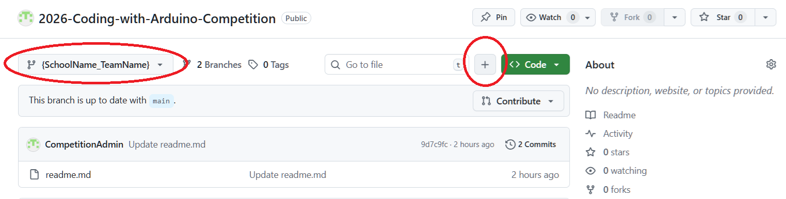
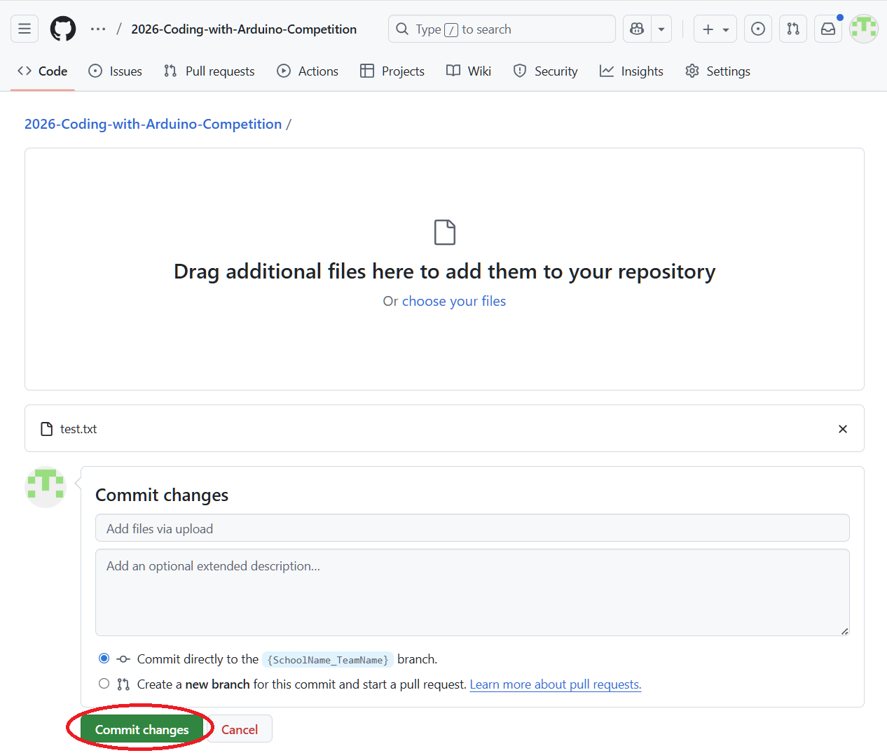

# Coding with Arduino Software Engineering Competition

Use this Git repo to upload your teams code so that our judges can review it prior to the competition.  This can be done by creating a branch and then uploading your code to your newly created branch.  When naming your branch please use this format: {SchoolName}_{TeamName}

For example: <b>AcmePublicSchools_RabidVipers</b>

At the top of your source code please include comments that include your school name, your teachers name, and the names of each student on your team in addition to the grade they are in.

For a tutorial on how to use the supplied Arduino kit go to here: https://download.elegoo.com/?t=UNO_R3_Project_Super_Starter_Kit

For a tutorial on how to create a branch using GitHub go here: https://docs.github.com/en/pull-requests/collaborating-with-pull-requests/proposing-changes-to-your-work-with-pull-requests/creating-and-deleting-branches-within-your-repository

## Quickstart guide to creating a branch
   1. On GitHub, navigate to the main page of the repository '2026-Coding-with-Arduino-Competition'
      
      
   2. From the file tree view on the left, select the 'main' dropdown menu, then click the 'View all branches' button. 
      
      
   3. Click New branch
      
      
   4. Under 'Branch name", type the name of your branch using the <b>'SchoolName_TeamName'</b> format.  Click the 'Create new branch' button.
      
      
   5. Click on your new branch
      
      
   6. On the top left make sure that your new branch is selected from the dropdown menu.  Then click on the ‘plus’ button on the right-hand side of the screen.
      

   7. Drag and drop your source code in the rectangle in the middle of the screen.  Then click on the ‘Commit changes’ button.  You have now uploaded your source code to Github!
      

